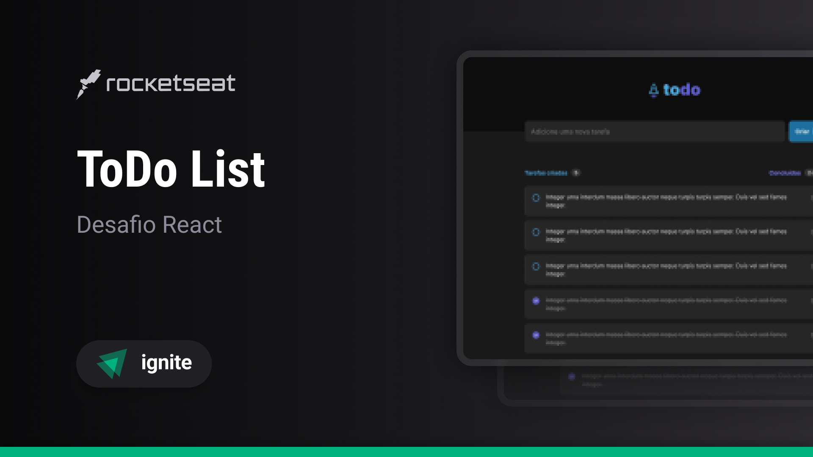
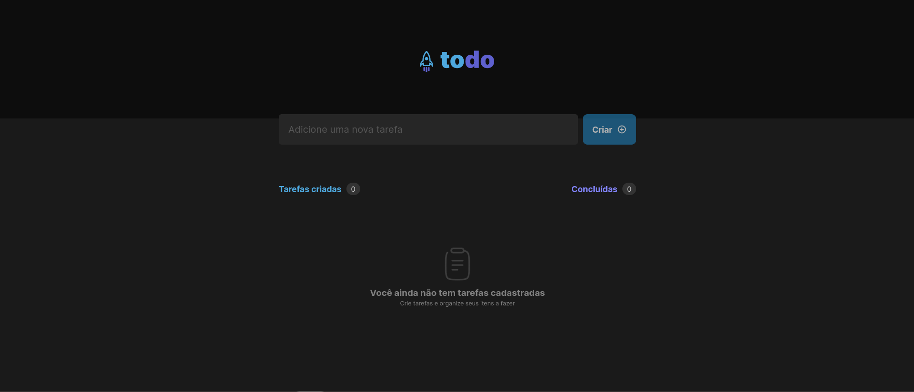
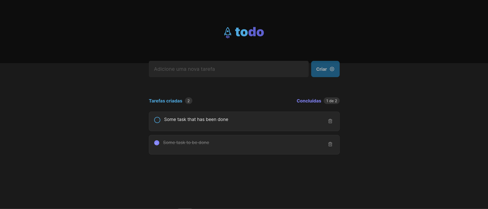
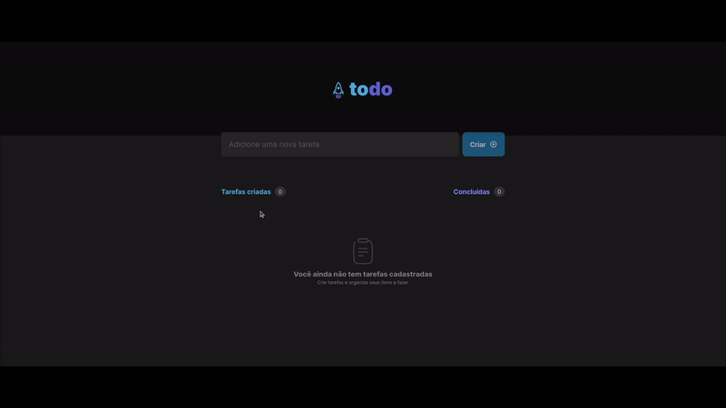
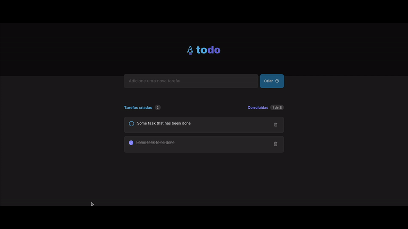
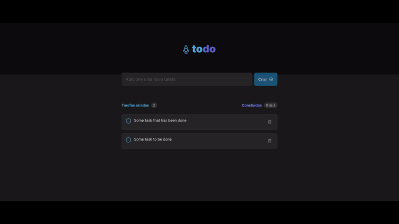
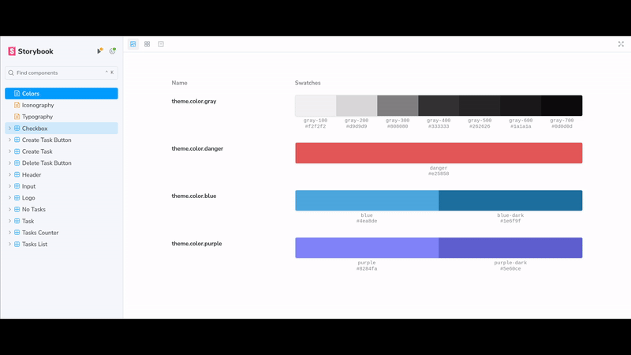
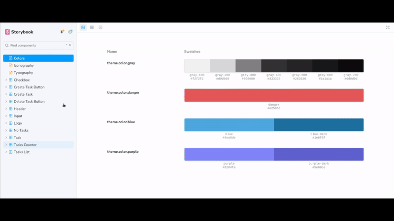

<h1 align='center'> Ignite ToDo List </h1>

<div align='center'>

  
  
  [](https://opensource.org/licenses/MIT)

  [🎨 Design](https://www.figma.com/file/HV7C6SQl1SyA1mN8Xur2bv/ToDo-List-%E2%80%A2-Desafio-React-(Copy)?type=design&node-id=56-96&mode=design&t=MDvKh9d18LPYlRNA-0)

  [🇬🇧 English](#en) / [🇧🇷 Português](#pt-br)

</div>

## <a id='en' style='text-decoration: none; color: inherit;'>🇬🇧 English</a>

### 📚 Summary
- [❕ About](#en-about)
- [📖 Instructions](#en-instructions)
  - [📥 Install](#en-install)
  - [🚀 Run Locally](#en-locally)
  - [📋 Run Unit Tests](#en-unit-tests)
  - [📔 Run Storybook](#en-storybook)
- [📂 Structure](#en-structure)

#### <a id='en-about' style='text-decoration: none; color: inherit;'>❕ About</a>
This is my implementation of the challenge project "ToDo List" from the first ReactJS module of [Ignite](https://www.rocketseat.com.br/ignite), an intermediate and advanced course in various programming languages and technologies offered by [Rocketseat](https://www.rocketseat.com.br/).

It implements the following functionalities, which will be demonstrated in photos and videos later on:
- **Task Creation:** Describe in the text field and press Enter or click the adjacent button to create the task with the specified description.
- **Task Deletion:** Click on the trash can icon of the task to delete it.
- **Complete Tasks:** Check the box next to the text or click on it to mark the task as done.

#### <a id='en-instructions' style='text-decoration: none; color: inherit;'>📖 Instructions</a>
##### <a id='en-instalar' style='text-decoration: none; color: inherit;'>📥 Install</a>
Paste the 1º command into a terminal open within a folder of your preference to clone the project, then run one of the versions of the 2º command to install the dependencies
```sh
git clone https://github.com/mar-alv/ignite-todo-list.git
npm i # Or npm install
```

##### <a id='en-locally' style='text-decoration: none; color: inherit;'>🚀 Run Locally</a>
Paste the command into a terminal, the application will be accessable through this [link](http://localhost:5173)

```sh
npm run dev
```

##### <a id='en-unit-tests' style='text-decoration: none; color: inherit;'>📋 Run Unit Tests</a>
Paste the command into a terminal, they will be exectued one after the other mentioning if there were failed tests
```sh
npm run tests
```

##### <a id='en-storybook' style='text-decoration: none; color: inherit;'>📔 Run Storybook</a>
Paste the command into a terminal, the project's components documentation will be accessible through this [link](http://localhost:6006)
```sh
npm run storybook
```

#### <a id='en-structure' style='text-decoration: none; color: inherit;'>📂 Structure</a>
```
│ .storybook/
│   └── ... files to keep Storybook working
│ .tests/
│   └── ... files to keep tests working
│ src/
│   ├── assets/
│   │     └── ... svgs used
│   ├── components/
│   │     ├── componente x/
│   │     │     ├── index.tsx
│   │     │     └── styles.ts
│   │     └── ...
│   ├── contexts/
│   │     └── ... contexts and providers
│   ├── styles/
│   │     └── ... global styles and default theme
│   ├── interfaces/
│   │     └── ... interfaces used
│   └── ...
│ stories/
│   ├── components/
│   │     └── ... stories of the components
│   ├── ... generic stories (color, icons e typography)
│   └── ... stories-utils.tsx // util functions for stories
│ tests/
│   ├── ... unit tests
│   └── ... tests-utils.tsx // util functions for tests
```

## <a id='pt-br' style='text-decoration: none; color: inherit;'>🇧🇷 Português</a>

### 📚 Sumário
- [❕ Sobre](#pt-br-sobre)
- [📖 Instruções](#pt-br-instrucoes)
  - [📥 Instalar](#pt-br-instalar)
  - [🚀 Rodar Localmente](#pt-br-localmente)
  - [📋 Rodar Testes Unitários](#pt-br-testes-unitarios)
  - [📔 Rodar Storybook](#pt-br-storybook)
- [📂 Estrutura](#pt-br-estrutura)

#### <a id='pt-br-sobre' style='text-decoration: none; color: inherit;'>❕ Sobre</a>
Esta é a minha implementação do desafio "ToDo List" do primeiro módulo de ReactJS do [Ignite](https://www.rocketseat.com.br/ignite), um curso intermediário e avançado de diversas linguagens de programação e tecnologias oferecido pela [Rocketseat](https://www.rocketseat.com.br/).

Nela, foram implementadas as seguintes funcionalidades, que serão demonstradas em fotos e vídeos mais adiante:
- **Criação de tarefas:** Descreva no campo de texto e pressione Enter ou clique no botão ao lado para criar a tarefa com a descrição especificada.
- **Deleção de tarefas:** Clique no ícone de lixeira da tarefa para deletá-la.
- **Completar tarefas:** Marque a caixa ao lado do texto ou clique nela para marcar a tarefa como concluída.

#### <a id='pt-br-instrucoes' style='text-decoration: none; color: inherit;'>📖 Instruções</a>
##### <a id='pt-br-instalar' style='text-decoration: none; color: inherit;'>📥 Instalar</a>
Cole o 1º comando em um terminal aberto dentro de uma pasta de sua preferência para clonar o projeto, em seguida rode uma das versões do 2º comando para instalar as dependências
```sh
git clone https://github.com/mar-alv/ignite-todo-list.git
npm i # Ou npm install
```

##### <a id='pt-br-localmente' style='text-decoration: none; color: inherit;'>🚀 Rodar Localmente</a>
Cole o comando em um terminal, a aplicação estará acessível através desse link: http://localhost:5173 
```sh
npm run dev
```

##### <a id='pt-br-testes-unitarios' style='text-decoration: none; color: inherit;'>📋 Rodar Testes Unitários</a>
Cole o comando em um terminal, eles serão executados um atrás do outro apontando se houve testes falhos
```sh
npm run tests
```

##### <a id='pt-br-storybook' style='text-decoration: none; color: inherit;'>📔 Rodar Storybook</a>
Cole o comando num terminal, a documentação dos componentes do projeto estará acessível através desse [link](http://localhost:6006)
```sh
npm run storybook
```

#### <a id='pt-br-estrutura' style='text-decoration: none; color: inherit;'>📂 Estrutura</a>
```
│ .storybook/
│   └── ... arquivos que mantém o funcionamento do Storybook
│ .tests/
│   └── ... arquivos que mantém o funcionamento dos testes
│ src/
│   ├── assets/
│   │     └── ... svgs usados
│   ├── components/
│   │     ├── componente x/
│   │     │     ├── index.tsx
│   │     │     └── styles.ts
│   │     └── ...
│   ├── contexts/
│   │     └── ... contextos e providers
│   ├── styles/
│   │     └── ... estilos globais e default
│   ├── interfaces/
│   │     └── ... interfaces usadas
│   └── ...
│ stories/
│   ├── components/
│   │     └── ... stories dos componentes
│   ├── ... stories genéricos(cor, ícones e tipografia)
│   └── ... stories-utils.tsx // funções utilitárias pros stories
│ tests/
│   ├── ... testes unitários
│   └── ... tests-utils.tsx // funções utilitárias pros testes
```


## 🧰 Technologies
### Build Tools
[](https://vitejs.dev/)

### Documentation
[](https://storybook.js.org/)

### Front-end Framework
[](https://reactjs.org/)
[](https://www.typescriptlang.org/)

### Styling
[](https://phosphoricons.com/)
[](https://styled-components.com/)

### Testing
[](https://testing-library.com/docs/react-testing-library/intro)
[](https://jestjs.io/)

## 📸 Screenshots and 🎥 Recordings
For a longer video demonstration click here and like my post on
<a href='https://www.linkedin.com/feed/update/urn:li:activity:7016166450579058688'>LinkedIn</a>

<div align='center'>

  
  Empty list

</div>

<div align='center'>

  
  Filled list

</div>

<div align='center'>

  
  Creating task

</div>

<div align='center'>

  
  Removing task

</div>

<div align='center'>

  
  Toggle task

</div>

<div align='center'>

  
  Generic stories

</div>

<div align='center'>

  
  Components stories

</div>

## Author
<div style='display: flex; align-items: center;'>
    
    <div>
        <strong>Marcelo Alvarez</strong>
        <br>
        <em>Front-end Developer</em><br>
        <span>"Some AI generated funny quote here 😗"</span><br>
        <a href='https://www.linkedin.com/in/marcelo-dos-santos-alvarez-474406180/'>LinkedIn</a>
    </div>
</div>

## License
Licensed under [MIT](./LICENSE)
