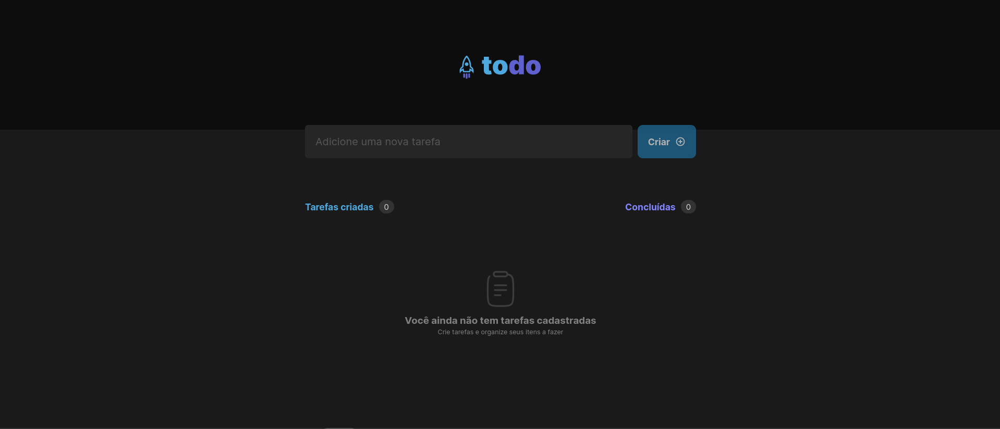

<h1 align='center'> Ignite ToDo List </h1>

<div align='center'>

  
  
  [](https://opensource.org/licenses/MIT)

  [🎨 Design](https://www.figma.com/file/HV7C6SQl1SyA1mN8Xur2bv/ToDo-List-%E2%80%A2-Desafio-React-(Copy)?type=design&node-id=56-96&mode=design&t=MDvKh9d18LPYlRNA-0)

  [⬅️ Voltar](../README.md)

</div>

## 📚 Sumário
- [❕ Sobre](#about)
- [📖 Instruções](#instructions)
  - [📥 Instalar](#install)
  - [🚀 Rodar Localmente](#locally)
  - [📋 Rodar Testes Unitários](#unit-tests)
  - [📔 Rodar Storybook](#storybook)
- [📂 Estrutura](#structure)
- [🧰 Tecnologias](#technologies)
- [📸 Prints e 🎥 Gravações](#screenshots-prints)
- [👤 Autor](#author)
- [📄 Licença](#license)

### <a id='about' style='text-decoration: none; color: inherit;'>❕ Sobre</a>
Esta é a minha implementação do desafio "ToDo List" do primeiro módulo de ReactJS do [Ignite](https://www.rocketseat.com.br/ignite), um curso intermediário e avançado de diversas linguagens de programação e tecnologias oferecido pela [Rocketseat](https://www.rocketseat.com.br/).

Nela, foram implementadas as seguintes funcionalidades, que serão demonstradas em fotos e vídeos mais adiante:
- **Criação de tarefas:** Descreva no campo de texto e pressione Enter ou clique no botão ao lado para criar a tarefa com a descrição especificada.
- **Deleção de tarefas:** Clique no ícone de lixeira da tarefa para deletá-la.
- **Completar tarefas:** Marque a caixa ao lado do texto ou clique nela para marcar a tarefa como concluída.

### <a id='instructions' style='text-decoration: none; color: inherit;'>📖 Instruções</a>
#### <a id='install' style='text-decoration: none; color: inherit;'>📥 Instalar</a>
Cole o 1º comando em um terminal aberto dentro de uma pasta de sua preferência para clonar o projeto
```sh
git clone https://github.com/mar-alv/ignite-todo-list.git
```

Em seguida rode uma das versões do 2º comando para instalar as dependências
```sh
npm i
```
```sh
npm install
```

#### <a id='locally' style='text-decoration: none; color: inherit;'>🚀 Rodar Localmente</a>
Cole o comando em um terminal, a aplicação estará acessível através desse [link](http://localhost:5173)
```sh
npm run dev
```

#### <a id='unit-tests' style='text-decoration: none; color: inherit;'>📋 Rodar Testes Unitários</a>
Cole o comando em um terminal, eles serão executados um atrás do outro apontando se houve testes falhos
```sh
npm run tests
```

#### <a id='storybook' style='text-decoration: none; color: inherit;'>📔 Rodar Storybook</a>
Cole o comando num terminal, a documentação dos componentes do projeto estará acessível através desse [link](http://localhost:6006)
```sh
npm run storybook
```

### <a id='structure' style='text-decoration: none; color: inherit;'>📂 Structure</a>
```
│ .storybook/
│   └── ...
│ .tests/
│   └── ...
│ docs/
│   └── ...
│ src/
│   ├── assets/
│   │     └── ...
│   ├── components/
│   │     ├── componente x/
│   │     │     └── ...
│   │     └── ...
│   ├── contexts/
│   │     └── ...
│   ├── styles/
│   │     └── ...
│   ├── interfaces/
│   │     └── ...
│   └── ...
│ stories/
│   ├── components/
│   │     └── ...
│   └── ...
│ tests/
│   └── ...
```

### <a id='technologies' style='text-decoration: none; color: inherit;'>🧰 Tecnologias</a>
#### Build
[](https://vitejs.dev/)

#### Documentação
[](https://storybook.js.org/)

#### Framework Front-end
[](https://reactjs.org/)
[](https://www.typescriptlang.org/)

#### Estilização
[](https://phosphoricons.com/)
[](https://styled-components.com/)

#### Testes
[](https://testing-library.com/docs/react-testing-library/intro)
[](https://jestjs.io/)

### <a id='screenshots-prints' style='text-decoration: none; color: inherit;'>📸 Prints e 🎥 Gravações</a>
Para uma demonstração mais longa clique aqui e curta meu post no <a href='https://www.linkedin.com/feed/update/urn:li:activity:7016166450579058688'>LinkedIn</a>

<div align='center'>

  
  Lista vazia

</div>

<div align='center'>

  
  Lista com tarefas

</div>

<div align='center'>

  
  Criando tarefa

</div>

<div align='center'>

  
  Removendo tarefa

</div>

<div align='center'>

  
  Trocando estado da tarefa

</div>

<div align='center'>

  
  Stories Genéricos

</div>

<div align='center'>

  
  Stories dos componentes

</div>

### <a id='author' style='text-decoration: none; color: inherit;'>👤 Autor</a>
<div style='display: flex; align-items: center;'>
		
		<div>
				<strong>Marcelo Alvarez</strong>
				<br>
				<em>Front-end Developer</em><br>
				<span>"Uma citação engraçada gerada por IA aqui 😗"</span><br>
				<a href='https://www.linkedin.com/in/mar-alv'>
					
				</a>
				<a href='https://mar-alv.github.io/'>
					
				</a>
		</div>
</div>

### <a id='license' style='text-decoration: none; color: inherit;'>📄 Licença</a>
Licenciado via [MIT](../LICENSE)
